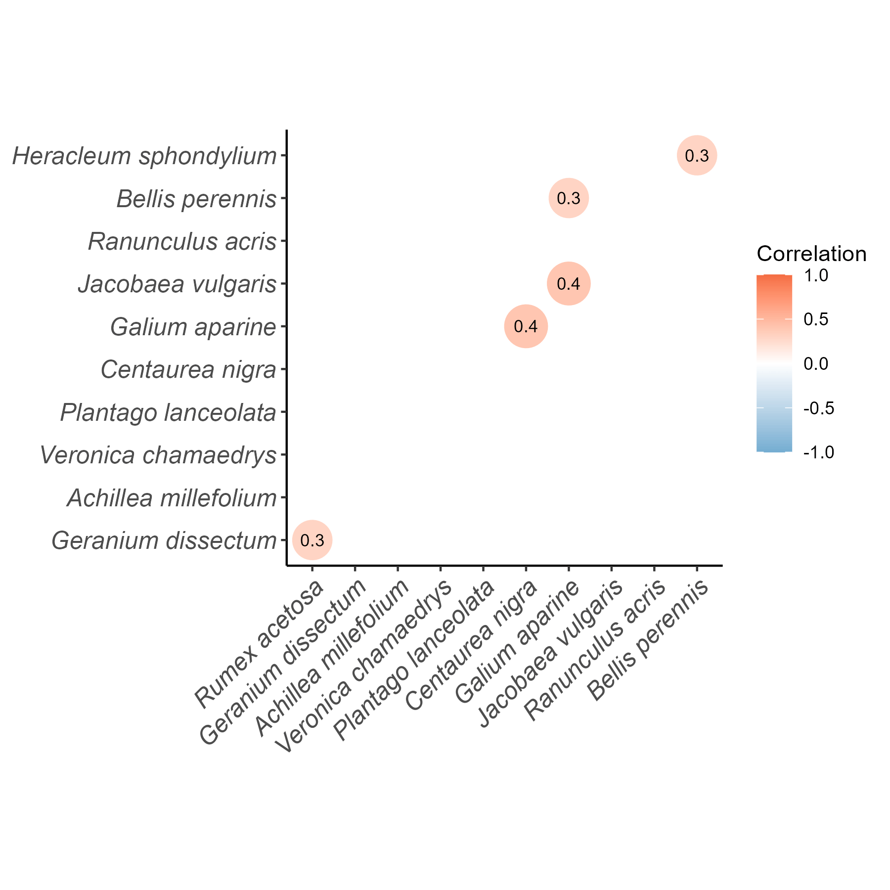

# The Effect of Environmental Conditions on Dicot Plant Biodiversity

## Overview
This study investigated how an environmental gradient of temperature and 
moisture affects the biodiversity of dicot plant species. Percentage cover 
of target herb species was estimated along a 12m gradient using morphological 
identification keys, with species identification confirmed via PCR, Sanger 
sequencing, and BLAST.

This is the sister repository to https://github.com/joelbetteridge/festuca-microbiome-scandes-gradient-norway as part of my second year molecular systematics module. Grade achieved for R studio = 95% and for report = 81%. 

## Data
All raw data is stored in `data-raw/`.

- **class_data.xlsx** — sample-level data where each row is a unique sample 
  and columns represent: sample position (m), temperature (°C), moisture (%), 
  and percentage cover for each recorded species.

## Analysis
The analysis script imports, explores, and tests the relationship between 
dicot species and moisture/temperature using:
- Shannon diversity index, with Cook's distance used to check for influential 
  outliers
- Spearman's rank correlation to test significance of relationships
- Species-level analysis and a correlation plot (`ggcorrplot`) comparing 
  individual species responses

Figures generated by this script are included in `figures/`

**Example figure:**

## Packages used
- `tidyverse` — data import, manipulation, and plotting
- `readxl` — reading Excel data
- `vegan` — Shannon diversity index
- `ggcorrplot` — correlation plot visualisation

## Author

**Joel Betteridge**  
University of York, BSc Ecology (Second Year)
